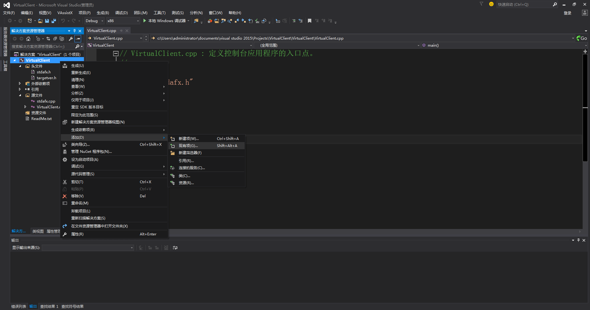

# <center>PositionSocket使用说明</cetner>

## 项目简介

PositionSocket动态库主要用于便携式电磁辐射源侦查定位系统的设备控制，定位系统显控终端与监测节点数据通信过程如图1所示。显控终端与监测节点数据通信分为综控通路和遥测通路，综控通路用于显控终端向监测节点下发指令并接收指令工作结果，遥测通路用于显控终端接收监测节点发来的遥测数据。综控通路下，动态库将显控终端下发的指令数据以数据流的形式发送到监测节点，监测节点接收到指令后回传指令工作结果数据流，动态库按程控协议从数据流中提取指令工作结果数据帧输出到显控终端。遥测通路下，动态库按程控协议从数据流中提取遥测数据帧输出到显控终端。


<center>图1 显控终端与监测节点数据通信</center>

## 环境依赖

### 操作系统

- Windows 7  32bit and 64bit
- Windows 10  32bit and 64bit

### 开发环境

- Microsoft Visual Studio Professional 2015 Update 3或者更高版本。

## 快速入门

### 准备设备和配件

- Win7或者Win10操作系统的计算机一台
- 便携式电磁辐射源监测节点一个
- 便携式电磁辐射源监测节点专用电源
- 点对点网线一根
- 监测天线及电缆

### 连接设备

1. 使用点对点网线连接计算机与监测节点。
2. 架设好监测天线，将天线电缆接头连接监测节点天线接口。
3. 将监测节点与专用电源连接。
4. 计算机开机，将计算机网络IP与监测节点IP设置为同一网段（例如计算机IP：192.168.1.106，监测节点IP：192.168.1.10），计算机子网掩码设置为“255.255.255.0”。
5. 监测节点加电开机。

### 建立显控终端开发环境

- Step 1：打开Microsoft Visual Studio Professional 2015后，点击"文件"->"新建"->"项目"，在弹出的对话中框选择“Win32”工程类型，在右侧的工程模板中选择“Win32 控制台应用程序”，在下方填入工程名字ClientExample，点击“确定”，在后面的向导中直接选择“完成”。如图2所示。


<center>图2 创建控制台工程</center>

- Step 2：把相应版本的动态库文件夹下的所有文件拷贝到该工程源代码文件（.h与.cpp文件）所在文件夹中。

- Step 3：在“解决方案资源管理器”窗口的工程名字处，点击鼠标右键，在弹出的菜单中点击“添加”->"现有项..."，把动态库中的头文件PositionSocketAPI.h加入工程列表中。如图3所示。



<center>图3 添加头文件</center>

- Step 4：点击菜单栏中的"视图"，在弹出的选项中依次点击“其它窗口”->“属性管理器”，点击完成后会显示“属性管理器”窗口。如图4所示。


<center>图4 添加属性管理器</center>

- Step 5：在“属性管理器”窗口的工程名字处，点击鼠标右键，在弹出的选项中点击“添加新属性表”，弹出“添加新项”对话框，在下方填入名称 MySheet.props，点击“添加”。如图5所示。


<center>图5 添加属性页</center>

添加完成后在工程下的四个版本的文件夹下会出现新建的属性页。如图6所示。


<center>图6 显示属性页</center>

- Step 6：双击新建的属性页 MySheet，在弹出的对话框中依次点击“通用属性”->“连接器”->“输入”，在右侧列表框的"附加依赖项"添加文件名PositionSocket.lib。如图7所示。


<center>图7 添加依赖库</center>

注意：以上过程展示了如何调用64位版本的动态库，如需调用其它版本的动态库，需要在Step 2中将相应版本的库文件拷贝到工程源代码文件（.h与.cpp文件）所在文件夹中。

### 使用动态库建立显控连接

在“ClientExample.cpp”中输入如下代码，您可以直接复制过去，这段代码展示了如何使用动态库与监测节点建立连接，向监测节点发送指令，接收监测节点回传的指令工作结果和遥测数据。

```c++
#inlude "stdafx.h"             //包含预编译头文件
#include <stdint.h>            //包含标准库头文件
#include <stdlib.h>            //包含标准库头文件
#include <windows.h>
#include "PositionSocketAPI.h" //包含动态库中的头文件
using namespace ZBSYB_RADAR_SOCKET; //应用命名空间

//连接状态
bool isconnect = false;
//定义回调函数
//1.通道状态回调函数
void OnSessionState(ChannelState state, void* userPointer)
{
	if (state == CONNECTED)
	{
		isconnect = true;
	}
	else if (state == DISCONNECTED)
	{
		isconnect = false;
		printf("断开连接\n");
	}
}
//2.终控回调函数
void OnZKResult(const ZKResult* zkResult, void* userPointer)
{
	if (zkResult->startstopframe != nullptr)
	{
		printf("启动/停止结果回传,命令ID号:%0x\n", zkResult->startstopframe->header.commandID);
	}
	else if (zkResult->locktrackframe != nullptr)
	{
		printf("锁定跟踪结果回传,命令ID号:%0x\n", zkResult->locktrackframe->header.commandID);
	}
	else if (zkResult->selfdetectframe != nullptr)
	{
		printf("自检结果回传,命令ID号:%0x\n", zkResult->selfdetectframe->header.commandID);
	}
	else
	{
		printf("无结果回传......\n");
	}
}
//3.遥测回调函数
void OnYCResult(const YCResult* ycResult, void* userPointer)
{
	if (ycResult != nullptr)
	{
		printf("遥测数据回传，遥测数据:remoteData[%d]--remoteData[%zu]\n", 0, ycResult->length - 1);
	}
}

int main()
{
	//定义句柄变量
	int ps_handler;
	//初始化库
	PS_InitSSLib();
	//定义回调函数集合
	SessionHandler callback{ 0 };
	callback.userPointer = (void*)0x1223;
	callback.cbZK.cbCon = OnSessionState; //赋值为终控通道状态回调函数名
	callback.cbZK.cbResult = OnZKResult;  //赋值为终控回调函数
	callback.cbYC.cbCon = OnSessionState; //赋值为遥测通道状态回调函数名
	callback.cbYC.cbResult = OnYCResult;  //赋值为遥测回调函数名
	//设置监测节点IP地址
	const char* addr = "127.0.1.1:5555";
	//建立连接
	PS_CreateConnect(&ps_handler, addr, &callback);
	while (true)
	{
		if (isconnect == true)
		{
			printf("连接成功%s...\n", addr);
			break;
		}
		else
		{
			printf("尝试连接%s...\n", addr);
		}
		Sleep(500);
	}
	//发送自检指令
	PS_SendSelfDetect(ps_handler);
	system("pause");
	//发送参数配置指令
	ParamConfFrame paramconfframe;
	ParamConfParam paramconf;
	PS_SendParaConf(&paramconfframe, ps_handler, &paramconf);
	system("pause");
	//发送启动指令
	PS_SendStartStop(ps_handler, 1);
	system("pause");
	//发送停止指令
	PS_SendStartStop(ps_handler, 0);
	system("pause");
	//关闭连接
	PS_CloseConnect(ps_handler);
	//关闭库
	PS_DeinitSSLib();
	return 0;
 }  
```
注意：需要将IP地址设置为监测节点地址和端口号，如：192.168.1.10 :5050。

在输入这些代码后，注释发送指令代码，按“F5”编译运行，如果连接成功，程序会在命令行窗口显示“连接成功127.0.0.1:5555...”，表明此时计算机利用动态库成功的建立起与设备端的连接。如图9所示。如果连接失败，程序会在命令行窗口刷新显示“尝试连接127.0.0.1:5555...”。如图10所示。


<center>图9 连接成功</center>


<center>图10 连接失败</center>

### 通过显控终端发送指令

取消发送指令代码注释，按“F5”编译运行，命令行窗口显示send complete，error code=0”，表明指令发送成功，命令行窗口显示“Response Succeed”，表明自检指令响应成功并接收到回传结果，命令行窗口显示“启动/ 停止结果回传，命令ID号：10000002”，表明通过回调函数接收到启动/ 停止指令回传结果。如图11所示。本示例代码只展示了如何发送自检指令和启动停止指令，如要使用其它发送指令请参考接口说明。


<center>图11 发送指令</center>

## 使用详细说明

### 技术原理介绍

动态库PositionSocket依赖于动态库SuperSocket，SuperSocket用于数据流的收发，PositionSocket用于数据帧的打包和解析。利用动态库进行定位系统显控终端与监测节点通信的过程如图12所示。显控终端与监测节点数据通信分为综控通路和遥测通路，综控通路用于下发指令并接收回传结果，遥测通路用于接收遥测数据。综控通路下，当显控终端与监测节点建立连接并发送指令后，动态库PositionSocket按程控协议将指令打包通过动态库SuperSocket以数据流的形式发送到监测节点，监测节点接收到指令后向SuperSocket回传指令工作结果数据流，动态库按程控协议从数据流中提取令工作结果数据帧输出到显控终端。遥测通路下，当显控终端与监测节点建立连接后，动态库SuperSocket会持续接收到遥测数据流，动态库按程控协议从数据流中提取遥测数据帧输出到显控终端。


<center>图12 定位系统显控终端与监测节点数据通信过程</center>

动态库PositionSocket主要包含两类通路两类接口。如图13所示。第一类通路为综控通路，用于显控终端向监测节点下发指令，并接收监测节点回传的工作结果。第二类通路为遥测通路，用于接收监测节点给显控终端发送的遥测数据。第一类接口为初始化/释放资源接口，包括初始化库、关闭库、建立连接、关闭连接接口。初始化库用于获得调用库函数时所需的资源，初始化库函数是使用库时第一个调用的函数，且只调用一次。关闭库用于释放资源，关闭库函数是不在使用库时调用的函数，也只调用一次。建立连接用于根据IP地址建立显控终端与监测节点的连接，获得代表连接的句柄描述，将用户定义的用于接收监测节点连接状态、指令回传结果、遥测数据的函数地址传递给动态库。关闭连接用于断开显控终端与监测节点的连接，并销毁句柄。第二类接口为发送指令接口。通过发送指令接口向监测节点发送指令，该类接口需要将建立连接时获得的句柄作为一个输入参数。当发送指令后，接收指令回传结果有两种情况，一种情况是指令回传结果作为发送指令函数的输出参数，一种情况是指令回传结果通过用户定义的接收指令回传结果函数输出。


<center>图13 动态库PositionSocket主要结构</center>

### 调用主要步骤

通过显控终端程序及动态库详细说明可以看出，调用动态库主要步骤如下：

- <strong>Step 1：#include "PositionSocketAPI.h" </strong>

包含头文件PositionSocketAPI.h，该文件主要内容为声明对外接口函数、定义动态库中用到的结构体、枚举变量，详细介绍参见接口及数据类型说明。  

- <strong>Step 2：调用PS_InitSSLib()函数初始化库。</strong>

该函数为使用动态库时第一个调用的函数，必须调用且仅调用一次（见代码中初始化库），通过该函数初始化调用库函数时需要的一些资源。与该函数对应的是关闭库函数PS_DeinitSSLib()，当不在使用动态库时，通过PS_DeinitSSLib()函数释放初始化的资源。

- <strong>Step 3：定义回调函数集合、设置ip地址、调用PS_CreateConnect()函数与监测节点建立连接，获得句柄ps_handler描述。</strong>

PS_CreateConnect()函数根据输入的监测节点IP地址建立显控终端与监测节点的连接，获得代表连接的一个句柄，该句柄通常作为调用库的其它函数的一个输入参数。PS_CreateConnect()函数将用户定义的用于接收通路连接状态、综控命令回传结果及遥测数据的函数地址传递给动态库，因此动态库可以将通路连接状态、综控命令回传结果及遥测数据输出到用户定义的函数（回调函数）供用户使用。当发送综控命令后，接收综控指令回传结果有两种机制，一种是回传结果通过回调函数接收，在这种情况下需要定义一个接收命令回传结果的回调函数，在建立连接时将回调函数指针传递到动态库；另一种是回传结果作为发送指令函数的输出参数，在这种情况下用户需要开辟一个储存相应指令回传结果的缓冲区，调用发送指令函数后，指令回传结果将被写到缓冲区。PS_CreateConnect()函数原型为：

```c++
PS_CreateConnect(int* ps_handler, const char* peerAddress, const SessionHandler* handler);
```

在该函数的参数表中，第一个参数ps_handler为一个整形指针变量，为输出参数，该参数为一个句柄，代表显控终端与监测节点建立一个连接，你需要先定义一个整形的变量（见代码中定义句柄变量），然后取变量的地址放到该参数位置上。这个变量非常重要，在后续调用库的其它函数时，通常都会用到这个变量作为函数的输入参数，因此这个句柄需要一直保留着。第二个参数peerAddress为字符型指针变量，为输入参数，在这里直接输入监测节点IP地址和端口号字符串（见代码中设置监测节点IP地址）即可。第三个参数handler为SessionHandler类型指针变量，为输入参数，是用于接收监测节点连接状态、综控指令回传结果及遥测数据的<strong><font color=green>回调函数集合</font></strong>，你需要先创建一个SessionHandler类型的实例，初始化该实例（见代码中定义回调函数集合），然后取该实例地址放到该参数位置上。SessionHandler主要结构如下：

```c++
struct SessionHandler 
{
	void* userPointer; //用户输入的指针变量
	ZKCallbacks cbZK;  //综控回调函数集合
	YCCallbacks cbYC;  //遥测回调函数集合
};
```

<strong><font color=green>回调函数集合</font></strong>中userPointer为用户定义的类型为void指针。当回调函数定义为非静态的成员函数时，由于类的成员函数指针无法给用户自定义类型函数指针赋值，因此通常将回调函数定义为静态的。由于该接口为C语言接口，调用该接口的用户通常是C++用户，为了便于用户在静态回调函数中调用类的成员函数，需要定义类型为void指针，将该指针转化为实例的指针，通过实例的指针访问类的成员函数。如下示例代码所示，在静态函数OnSessionState()中通过将userPointer转化为实例指针访问类的成员函数_SessionState()。

```c++
//静态回调函数
void VirtualClient::OnSessionState(ChannelState state, void* userPointer)
{
	VirtualClient* self = (VirtualClient*)userPointer;
	self->_SessionState(state);
}
//类成员函数
void VirtualClient::_SessionState(ChannelState state)
{
}
```

<strong><font color=green>回调函数集合</font></strong>中cbZK为<strong><font color=#3366CC>综控回调函数集合</font></strong>，结构如下：

```c++
struct ZKCallbacks 
{
	CHANNEL_STATE_CALLBACK* cbCon; //通道状态回调函数指针
	ZK_RESULT_CALLBACK* cbResult;  //综控回调函数指针
};
```

<strong><font color=#3366CC>综控回调函数集合</font></strong>中cbCon为通道状态回调函数指针，通道状态回调函数用于接收通道的连接状态，你需要定义一个函数（见代码中通道状态回调函数），然后将函数名赋值给该指针，需要定义的函数类型如下：

```c++
typedef void CHANNEL_STATE_CALLBACK(ChannelState state, void* userPointer);
```

在该函数的参数表中，第一个参数state为通道连接状态，为输出参数，通过该参数可以获得显控终端与监测节点的连接状态，当state为CONNECTED时表明连接成功，当state为DISCONNECTED时表明连接断开，连接状态为枚举变量，主要有两种，结构如下：

```c++
enum ChannelState 
{
	CONNECTED,    //连接
	DISCONNECTED, //断开
};
```

第二个参数为userPointer是一个类型为void指针，为输出参数，通常为用户输入的void*值。

<strong><font color=#3366CC>综控回调函数集合</font></strong>中cbResult为终控回调函数指针，终控回调函数用于接收启动停止和锁定跟踪指令的回传结果，你需要定义一个函数（见代码中终控回调函数），然后将函数名赋值给该指针，需要定义的函数类型如下：

```c++
typedef void ZK_RESULT_CALLBACK(const ZKResult* zkResult, void* userPointer);
```

在该函数的参数表中，第一个参数zkResult为终控回传结果，为输出参数，通过该参数可以获得监测节点发来的启动停止或者锁定跟踪指令的回传结果，回传结果只有两种，结构如下：

```c++
struct ZKResult 
{
	StartStopFrame* startstopframe; //启动停止结果
	LockTrackFrame* locktrackframe; //锁定跟踪结果
};
```

其中，startstopframe为启动停止结果回传数据帧，locktrackframe为锁定跟踪结果回传数据帧，结构参见接口说明。
第二个参数userPointer是一个类型为void指针，为输出参数，通常为用户输入的void*值。

<strong><font color=green>回调函数集合</font></strong>中cbYC为<strong><font color=#3366CC>遥测回调函数集合</font></strong>，结构如下：

```c++
struct YCCallbacks
{
	CHANNEL_STATE_CALLBACK* cbCon; //通道状态回调函数指针
	YC_RESULT_CALLBACK* cbResult;  //遥测回调函数指针
};
```

<strong><font color=#3366CC>遥测回调函数集合</font></strong>中cbCon为通道状态回调函数指针，其作用和定义方法与<strong><font color=#3366CC>综控回调函数集合</font></strong>中的相同，不再重复介绍。

<strong><font color=#3366CC>遥测回调函数集合</font></strong>中cbResult为遥测回调函数指针，遥测回调函数用于接收监测节点端发给显控终端的遥测数据，你需要定义一个函数（见代码中遥测回调函数），然后将函数名赋值给该指针，需要定义的函数类型如下：

```c++
 typedef void YC_RESULT_CALLBACK(const YCResult* ycResult, void* userPointer);
```

在该函数的参数表中，第一个参数ycResult为遥测数据，为输出参数，通过该参数可以获得监测节点发来的遥测数据，结构如下：

```c++
struct YCResult 
{
	size_t length;   //遥测数据长度
	uint32_t* data;  //遥测数据起始地址
};
```

其中，length为遥测数据长度，data为遥测数据起始地址，根据这两个参数即可读取监测节点发来的遥测数据。

第二个参数userPointer是一个类型为void指针，为输出参数，通常为用户输入的void*值。

- <strong>Step 4：利用该句柄ps_handler发送数据，通过发送命令函数或者回调函数接收数据。</strong>

通过函数PS_CreateConnect()建立连接后即可获得句柄ps_handler描述符，该句柄作为发送指令函数的一个输入参数。通过发送指令函数发送指令后，接收回传结果分为两种方式，一种是指令回传结果作为发送函数的输出参数输出到显控终端，另一种是指令回传结果通过回调函数输出到程控端。

对于指令回传结果作为发送函数的一个参数输出的情况，以发送自检指令为例介绍，通过发送自检指令函数可以向监测节点发送自检指令，接收自检指令响应结果，发送自检指令函数原型为：

```c++
PS_SendSelfDetect(SelfDetectFrame* selfdetectframe,int ps_handler);//发送自检指令
```

在该函数的参数表中，第一个参数selfdetectframe为自检指令回传结果，为输出参数，通过该参数可以获得监测节点发来的自检指令回传结果，你需要开辟一个SelfDetectFrame类型的缓冲区（见代码中发送指令），然后取缓冲区地址放到这个参数的位置，发送自检指令后，自检指令回传结果会写到这个缓冲区，SelfDetectFrame结构见数据类型说明。第二个参数ps_handler为句柄，即PS_CreateConnect()函数的输出参数。

对于指令回传结果通过回调函数输出的情况，以发送启动停止指令为例介绍，通过发送启动停止函数可以向监测节点发送启动停止指令，通过回调函数接收启动停止指令响应结果，发送启动停止指令函数原型为：

```c++
PS_SendStartStop(int ps_handler,uint32_t option);//发送启动停止指令
```

在该函数的参数表中，第一个参数ps_handler为句柄，即PS_CreateConnect()函数的输出参数。第二个参数option为启动停止测量参数，启动测量时此参数设置为1，停止测量时此参数设置为0。可以看出在这种情况下，命令回传结果不是通过发送命令函数本身接收，因此不需要开辟一个存储回传结果的缓冲区，命令回传结果通过回调函数接收。

- <strong>Step 5：不再传输数据时，调用PS_CloseConnect()关闭与监测节点的连接，PS_CloseConnect()函数原型为：</strong>

```c++
PS_CloseConnect(ps_handler);//关闭连接
```

该函数所使用的唯一参数就是ps_handler句柄，即PS_CreateConnect()函数的输出参数，该函数的用途就是释放句柄所占用的资源。当您不在控制监测节点时，最好使用句柄作为参数来调用该函数，显示的关闭程控连接，以便确保连接所使用的资源被正确释放。

- <strong>Step 6：不再使用库时，调用PS_DeinitSSLib()关闭库。</strong>

该函数为使用动态库时最后一个调用的函数，调用此函数之后，除了PS_InitSSLib()，不能再调用其它接口函数。当您不在控制监测节点时，最好调用该函数，以便确保库所使用的资源被正确释放。

## 接口说明

### 初始化/释放资源接口

#### 初始化库/关闭库

##### PS_InitSSLib

函数声明：

```c++
PS_Error PS_InitSSLib();
```

函数功能：

初始化库，用于获取调用库函数时所需的资源。

备注：

该函数为使用动态库时第一个调用的函数，必须调用且仅调用一次。

##### PS_DeinitSSLib

函数声明：

```c++
PS_Error PS_DeinitSSLib();
```

函数功能：

关闭库，释放通过初始化库函数获得的资源。

备注：

该函数为使用动态库时最后一个调用的函数，仅调用一次，调用此函数之后，除了PS_InitSSLib()，不能再调用其它接口函数。

#### 建立/关闭连接

##### PS_CreateConnect

函数声明：

```c++
PS_Error PS_CreateConnect(int* ps_handler, const char* peerAddress, const SessionHandler* handler); 
```

函数功能：

根据IP地址建立程控端与设备端的连接，获得代表连接的句柄描述。

参数列表：

| 参数类型        | 参数名      | 参数说明                    |
| --------------- | ----------- | --------------------------- |
| int*            | ps_handler  | [out] 返回代表连接的句柄    |
| char*           | peerAddress | [in] 监测节点IP地址和端口号 |
| SessionHandler* | handler     | [in] 回调函数集合           |

##### PS_CloseConnect

函数声明：

```c++
PS_Error PS_CloseConnect(int ps_handler);
```

函数功能：

断开控制端与设备端的连接，销毁句柄。

参数列表：

| 参数类型 | 参数名     | 参数说明            |
| -------- | ---------- | ------------------- |
| int      | ps_handler | [in] 代表连接的句柄 |

### 发送指令接口

#### 指令回传结果通过回调函数接收

##### PS_SendStartStop

 函数声明：

```c++
PS_Error PS_SendStartStop(int ps_handler,uint32_t option);
```

函数功能：

启动测量指令用于控制节点按下发的工作参数上报工作结果。停止测量指令控制监测节点停止上报工作结果，停止频率扫描等工作。

参数列表：

| 参数类型 | 参数名     | 参数说明                                              |
| -------- | ---------- | ----------------------------------------------------- |
| int      | ps_handler | [in] 代表连接的句柄                                   |
| uint32_t | option     | [in] 启动测量时此参数设置为1，停止测量时此参数设置为0 |

##### PS_SendLockTrack

函数声明：

```c++
PS_Error PS_SendLockTrack(int ps_handler, const LockTrackParam* locktrack);
```

函数功能：

控制监测节点在已知目标信号确切参数或者是经过搜索列表获得相关目标信号后进行的操作。

参数列表：

| 参数类型        | 参数名     | 参数说明            |
| --------------- | ---------- | ------------------- |
| int             | ps_handler | [in] 代表连接的句柄 |
| LockTrackParam* | locktrack  | [in] 锁定跟踪参数   |

#### 指令回传结果通过发送函数输出

##### PS_SendSelfDetect

函数声明：

```c++
PS_Error PS_SendSelfDetect(SelfDetectFrame* selfdetectframe,int ps_handler);
```

函数功能：

显控终端给监测节点下发自检指令，用于监测节点执行自检并反馈自检结果。

参数列表：

| 参数类型         | 参数名          | 参数说明               |
| ---------------- | --------------- | ---------------------- |
| SelfDetectFrame* | selfdetectframe | [out] 自检指令回传结果 |
| int              | ps_handler      | [in] 代表连接的句柄    |

##### PS_SendReset

函数声明：

```c++
PS_Error PS_SendReset(ResetFrame* resetframe,int ps_handler);
```

函数功能：

控制监测节点硬件复位。

参数列表：

| 参数类型    | 参数名     | 参数说明               |
| ----------- | ---------- | ---------------------- |
| ResetFrame* | resetframe | [out] 复位指令回传结果 |
| int         | ps_handler | [in] 代表连接的句柄    |

##### PS_SendParaConf

函数声明：

```c++
PS_Error PS_SendParaConf(ParamConfFrame* paramconfframe, int ps_handler, 
                         const ParamConfParam* paramconf);
```

函数功能：

显控终端给监测节点下发频率扫描列表等工作参数，每组扫描参数用一帧命令下发。

参数列表：

| 参数类型        | 参数名         | 参数说明                   |
| --------------- | -------------- | -------------------------- |
| ParamConfFrame* | paramconfframe | [out] 参数配置指令回传结果 |
| int             | ps_handler     | [in] 代表连接的句柄        |
| ParamConfParam* | paramconf      | [in] 参数配置参数          |

##### PS_SendGPSModConf

函数声明：

```c++
PS_Error PS_SendGPSModConf(GPSConfFrame* gpsconfframe,int ps_handler);
```

函数功能：

GPS模块下发工作参数，使其工作在相应的工作模式。

参数列表：

| 参数类型      | 参数名       | 参数说明                      |
| ------------- | ------------ | ----------------------------- |
| GPSConfFrame* | gpsconfframe | [out] GPS模块配置指令回传结果 |
| int           | ps_handler   | [in] 代表连接的句柄           |

##### PS_SendCompassCalib

函数声明：

```c++
PS_Error PS_SendCompassCalib(CompassCalFrame* compasscalframe,int ps_handler);
```

函数功能：

电子罗盘校准。

参数列表：

| 参数类型         | 参数名          | 参数说明                       |
| ---------------- | --------------- | ------------------------------ |
| CompassCalFrame* | compasscalframe | [out] 电子罗盘校准指令回传结果 |
| int              | ps_handler      | [in] 代表连接的句柄            |

##### PS_SendIPConf

函数声明：

```c++
PS_Error PS_SendIPConf(IpConfFrame* ipconfframe, int ps_handler, uint32_t address);
```

函数功能：

对检测节点的IP等网口信息进行重配。

参数列表：

| 参数类型     | 参数名      | 参数说明                       |
| ------------ | ----------- | ------------------------------ |
| IpConfFrame* | ipconfframe | [out] 监测节点配置指令回传结果 |
| int          | ps_handler  | [in] 代表连接的句柄            |
| uint32_t     | address     | [in] 监测节点IP地址            |

##### PS_SendLowPower

函数声明：

```c++
PS_Error PS_SendLowPower(LowPowerConFrame* lowpowerconframe, int ps_handler, uint32_t option);
```

函数功能：

控制监测节点进入或退出低功耗工作模式。

参数列表：

| 参数类型          | 参数名           | 参数说明                                                  |
| ----------------- | ---------------- | --------------------------------------------------------- |
| LowPowerConFrame* | lowpowerconframe | [out] 低功耗指令回传结果                                  |
| int               | ps_handler       | [in] 代表连接的句柄                                       |
| uint32_t          | option           | [in] 进入低功耗时此参数设置为1，退出低功耗时此参数设置为0 |

##### PS_SendWaveGate

函数声明：

```c++
PS_Error PS_SendWaveGate(WaveGateSwitchFrame* wavegateswitchframe, int ps_handler, 
                         uint32_t option);
```

函数功能：

控制监测节点在有确切目标信号参数时调试使用。

参数列表：

| 参数类型             | 参数名              | 参数说明                                                  |
| -------------------- | ------------------- | --------------------------------------------------------- |
| WaveGateSwitchFrame* | wavegateswitchframe | [out] 波门控制指令回传结果                                |
| int                  | ps_handler          | [in] 代表连接的句柄                                       |
| uint32_t             | option              | [in] 波门控制开时此参数设置为1，波门控制关时此参数设置为0 |

##### PS_SendAGCCtrl

函数声明：

```c++
PS_Error PS_SendAGCCtrl(AgcControlFrame* agccontrolframe, int ps_handler, 
                        uint32_t option, uint32_t agcvalue);
```

函数功能：

调试增益控制。

参数列表：

| 参数类型         | 参数名          | 参数说明                                      |
| ---------------- | --------------- | --------------------------------------------- |
| AgcControlFrame* | agccontrolframe | [out] AGC控制指令回传结果                     |
| int              | ps_handler      | [in] 代表连接的句柄                           |
| uint32_t         | option          | [in] 开环时此参数设置为1，闭环时此参数设置为0 |
| uint32_t         | agcvalue        | [in] AGC值                                    |

##### PS_SendDetectThrd

函数声明：

```c++
PS_Error PS_SendDetectThrd(DetectThresholdFrame* detectthresholdframe, 
                           int ps_handler, uint32_t value);
```

函数功能：

调试增益控制。

参数列表：

| 参数类型              | 参数名               | 参数说明                       |
| --------------------- | -------------------- | ------------------------------ |
| DetectThresholdFrame* | detectthresholdframe | [out] 检测门限控制指令回传结果 |
| int                   | ps_handler           | [in] 代表连接的句柄            |
| uint32_t              | value                | [in] 检测门限值                |

##### PS_SendSoftwareUpdate

函数声明：

```c++
PS_Error PS_SendSoftwareUpdate(SoftwareUpdateFrame* softwareupdateframe, 
                               int ps_handler, uint32_t option, uint32_t type);
```

函数功能：

远程更新软件使用，实际更新数据通过数据通道下发。

参数列表：

| 参数类型             | 参数名              | 参数说明                                                     |
| -------------------- | ------------------- | ------------------------------------------------------------ |
| SoftwareUpdateFrame* | softwareupdateframe | [out] 软件更新指令回传结果                                   |
| int                  | ps_handler          | [in] 代表连接的句柄                                          |
| uint32_t             | option              | [in] 当软件更新开始时此参数设置为0xAA，当软件更新结束时此参数设置为0xBB |
| uint32_t             | type                | [in] FPGA软件此参数设置为0xAA，DSP软件参数设置为0xDD，校准数据此参数设置为0xCA。 |

##### PS_SendDeviceStatusSearch

函数声明：

```c++
PS_Error PS_SendDeviceStatusSearch(DeviceStatusSearchFrame* devicestatussearchframe,
                                   int ps_handler);
```

函数功能：

查询电池等设备信息。

参数列表：

| 参数类型                 | 参数名                  | 参数说明                   |
| ------------------------ | ----------------------- | -------------------------- |
| DeviceStatusSearchFrame* | devicestatussearchframe | [out] 设备查询指令回传结果 |
| int                      | ps_handler              | [in] 代表连接的句柄        |

##### PS_SendStandardCalib

函数声明：

```c++
PS_Error PS_SendStandardCalib(StandardCalibFrame* standardcalibframe, int ps_handler, 
                              uint32_t frqvalue);
```

函数功能：

查询电池等设备信息。

参数列表：

| 参数类型            | 参数名             | 参数说明               |
| ------------------- | ------------------ | ---------------------- |
| StandardCalibFrame* | standardcalibframe | [out] 标校指令回传结果 |
| int                 | ps_handler         | [in] 代表连接的句柄    |
| uint32_t            | frqvalue           | [in] 频率值            |

## 数据类型说明

### PS_Error

数据定义：

```c++
enum PS_Error 
{
	PS_ERR_NONE = 0,	            
	PS_ERR_INIT = -1,               
	PS_ERR_INVALID_HANDLE = -2,     
	PS_ERR_CONNECT = -3,            
	PS_ERR_SEND = -4,               
	PS_ERR_OVERTIME = -5,           
	PS_ERR_NO_HANDLE_RESOURCE = -6, 
	PS_ERR_CREATE_SOCKET = -7,      
};
```

PositionSocket动态库接口函数返回值。

数据项注释：

| 类型     | 名称                      | 功能           |
| -------- | ------------------------- | -------------- |
| PS_Error | PS_ERR_NONE               | 无错误         |
| PS_Error | PS_ERR_INIT               | 初始化库错误   |
| PS_Error | PS_ERR_INVALID_HANDLE     | 无效句柄       |
| PS_Error | PS_ERR_CONNECT            | 连接错误       |
| PS_Error | PS_ERR_SEND               | 发送错误       |
| PS_Error | PS_ERR_OVERTIME           | 响应超时       |
| PS_Error | PS_ERR_NO_HANDLE_RESOURCE | 无句柄资源     |
| PS_Error | PS_ERR_CREATE_SOCKET      | 创建SOCKET错误 |

### SessionHandler 

数据定义

```c++
struct SessionHandler 
{
	void* userPointer; 
	ZKCallbacks cbZK;  
	YCCallbacks cbYC;  
};
```

回调函数集合。

数据项注释：

| 类型        | 名称        | 功能                                 |
| ----------- | ----------- | ------------------------------------ |
| void*       | userPointer | 用户输入的指针变量，访问类的成员函数 |
| ZKCallbacks | cbZK        | 终控回调函数集合                     |
| YCCallbacks | cbYC        | 遥测回调函数集合                     |

#### ZKCallbacks

数据定义

```c++
struct ZKCallbacks 
{
	CHANNEL_STATE_CALLBACK* cbCon; 
	ZK_RESULT_CALLBACK* cbResult; 
};
```

综控回调函数集合。

数据项注释：

| 类型                    | 名称     | 功能                                         |
| ----------------------- | -------- | -------------------------------------------- |
| CHANNEL_STATE_CALLBACK* | cbCon    | 通道状态回调函数指针，该函数接收通路连接状态 |
| ZK_RESULT_CALLBACK*     | cbResult | 终控回调函数指针，该函数接收综控回传结果     |

##### ChannelState

数据定义

```c++
enum ChannelState 
{
	CONNECTED,    
	DISCONNECTED, 
};
```

连接状态。

数据项注释：

| 类型         | 名称         | 功能     |
| ------------ | ------------ | -------- |
| ChannelState | CONNECTED    | 连接     |
| ChannelState | DISCONNECTED | 断开连接 |

##### ZKResult

数据定义

```c++
struct ZKResult 
{
	StartStopFrame* startstopframe; 
	LockTrackFrame* locktrackframe; 
};
```

综控回传结果。

数据项注释：

| 类型            | 名称           | 功能                     |
| --------------- | -------------- | ------------------------ |
| StartStopFrame* | startstopframe | 存储启动停止指令回传结果 |
| LockTrackFrame* | locktrackframe | 存储锁定跟踪指令回传结果 |

#### YCCallbacks

数据定义

```c++
struct YCCallbacks
{
	CHANNEL_STATE_CALLBACK* cbCon;
	YC_RESULT_CALLBACK* cbResult;  
};
```

遥测回调函数集合。

数据项注释：

| 类型                    | 名称     | 功能                                         |
| ----------------------- | -------- | -------------------------------------------- |
| CHANNEL_STATE_CALLBACK* | cbCon    | 通道状态回调函数指针，该函数接收通路连接状态 |
| YC_RESULT_CALLBACK*     | cbResult | 遥测回调函数指针，该函数接收遥测数据         |

##### ChannelState

数据定义

```c++
enum ChannelState 
{
	CONNECTED,    
	DISCONNECTED, 
};
```

连接状态。

数据项注释：

| 类型         | 名称         | 功能     |
| ------------ | ------------ | -------- |
| ChannelState | CONNECTED    | 连接     |
| ChannelState | DISCONNECTED | 断开连接 |

##### YCResult

数据定义

```c++
struct YCResult 
{
	size_t length;   
	uint32_t* data;  
};
```

遥测数据。

数据项注释：

| 类型      | 名称   | 功能                 |
| --------- | ------ | -------------------- |
| size_t    | length | 存储遥测数据长度     |
| uint32_t* | data   | 存储遥测数据起始地址 |

### FrameHeader

数据定义

```c++
struct FrameHeader
{
	uint32_t syncWord;      
	uint32_t byteLength;    
	uint32_t commandID;      
	uint32_t response;        
	uint32_t counter;         
	uint32_t systemTime;      
};
```

综控指令回传结果数据帧帧头。

数据项注释：

| 类型     | 名称       | 功能               |
| -------- | ---------- | ------------------ |
| uint32_t | syncWord   | 同步字             |
| uint32_t | byteLength | 字节长度值         |
| uint32_t | commandID  | 命令ID号           |
| uint32_t | response   | 指令响应标志       |
| uint32_t | counter    | 指令响应次数累加值 |
| uint32_t | systemTime | 系统时标           |

### StartStopFrame

数据定义

```c++
struct StartStopFrame
{
	FrameHeader header;
	float GPSheight;               
	float GPSlat;                    
	float GPSlong;                  
	uint8_t SorN;                    
	uint8_t EorW;                  
	uint8_t statelite;              
	uint8_t hour;                   
	uint8_t minute;                
	uint8_t sec;                     
	uint8_t day;                    
	uint8_t month;                  
	uint16_t year;                  
	uint16_t obligate1;              
	uint32_t obligate2;              
	uint32_t frq;                   
	float azi;                       
	float ele;                       
	uint32_t LO_RF;                  
	uint32_t scan_index;            
	int32_t amp;                   
	uint32_t type;                 
	uint32_t fre_num;                
	uint32_t PW_num;                
	uint32_t PRI_num;                
	uint16_t fre[10];                
	uint16_t pw[10];                 
	uint16_t pri[10];              
	uint16_t temperature;            
	uint16_t Vcc_PL;                 
	uint16_t Vcc_LOC;                
	uint16_t obligate3;             
	float head;                      
	float pitch;                     
	float roll;                      
	float azi_j0;                   
	float ele_j0;                   
	float amp_max;                
	float amp_min;                  
	float amp_mean;                 
	uint32_t reserved[15];
	uint32_t checkSum;              
};
```

启动停止指令回传结果数据帧。

数据项注释：

| 类型名称功能 | 名称         | 功能                       |
| ------------ | ------------ | -------------------------- |
| FrameHeader  | header       | 综控指令回传结果数据帧帧头 |
| float        | GPSheight    | GPS海拔                    |
| float        | GPSlat       | GPS纬度                    |
| float        | GPSlong      | GPS经度                    |
| uint8_t      | SorN         | GPS南北纬                  |
| uint8_t      | EorW         | GPS东西经                  |
| uint8_t      | statelite    | GPS卫星数                  |
| uint8_t      | hour         | GPS时                      |
| uint8_t      | minute       | GPS分                      |
| uint8_t      | sec          | GPS秒                      |
| uint8_t      | day          | GPS日                      |
| uint8_t      | month        | GPS月                      |
| uint16_t     | year         | GPS年                      |
| uint16_t     | obligate1    | 预留                       |
| uint32_t     | obligate     | 预留                       |
| uint32_t     | frq          | 目标频率                   |
| float        | azi          | 目标方位角                 |
| float        | ele          | 目标俯仰角                 |
| uint32_t     | LO_RF        | 当前搜索频段本振           |
| uint32_t     | scan_index   | 扫描序列号                 |
| int32_t      | amp          | 目标信号功率               |
| uint32_t     | type         | 目标调制格式               |
| uint32_t     | fre_num      | 目标载频种类数             |
| uint32_t     | PW_num       | 目标脉宽种类数             |
| uint32_t     | PRI_num      | 目标重复周期种类数         |
| uint16_t     | fre[10]      | 载频参数值                 |
| uint16_t     | pw[10]       | 脉宽参数值                 |
| uint16_t     | pri[10]      | 重复周期参数值             |
| uint16_t     | temperature  | 硬件温度                   |
| uint16_t     | Vcc_PL       | 电压                       |
| uint16_t     | Vcc_LOC      | 电压                       |
| uint16_t     | obligate3    | 预留                       |
| float        | head         | GI方位                     |
| float        | pitch        | GI俯仰                     |
| float        | roll         | 横滚                       |
| float        | azi_j0       | 解耦后的方位角             |
| float        | ele_j0       | 解耦后的俯仰角             |
| float        | amp_max      | 幅度最大值                 |
| float        | amp_min      | 幅度最小值                 |
| float        | amp_mean     | 幅度均值                   |
| uint32_t     | reserved[15] | 预留                       |
| uint32_t     | checkSum     | 校验和                     |

### LockTrackFrame

数据定义

```c++
struct StartStopFrame
{
	FrameHeader header;
	float GPSheight;               
	float GPSlat;                    
	float GPSlong;                  
	uint8_t SorN;                    
	uint8_t EorW;                  
	uint8_t statelite;              
	uint8_t hour;                   
	uint8_t minute;                
	uint8_t sec;                     
	uint8_t day;                    
	uint8_t month;                  
	uint16_t year;                  
	uint16_t obligate1;              
	uint32_t obligate2;              
	uint32_t frq;                   
	float azi;                       
	float ele;                       
	uint32_t LO_RF;                  
	uint32_t scan_index;            
	int32_t amp;                   
	uint32_t type;                 
	uint32_t fre_num;                
	uint32_t PW_num;                
	uint32_t PRI_num;                
	uint16_t fre[10];                
	uint16_t pw[10];                 
	uint16_t pri[10];              
	uint16_t temperature;            
	uint16_t Vcc_PL;                 
	uint16_t Vcc_LOC;                
	uint16_t obligate3;             
	float head;                      
	float pitch;                     
	float roll;                      
	float azi_j0;                   
	float ele_j0;                   
	float amp_max;                
	float amp_min;                  
	float amp_mean;                 
	uint32_t reserved[15];
	uint32_t checkSum;              
};


```

锁定跟踪指令回传结果数据帧。

数据项注释：

| 类型名称功能 | 名称         | 功能                       |
| ------------ | ------------ | -------------------------- |
| FrameHeader  | header       | 综控指令回传结果数据帧帧头 |
| float        | GPSheight    | GPS海拔                    |
| float        | GPSlong      | GPS经度                    |
| float        | GPSlat       | GPS纬度                    |
| uint8_t      | SorN         | GPS南北纬                  |
| uint8_t      | EorW         | GPS东西经                  |
| uint8_t      | statelite    | GPS卫星数                  |
| uint8_t      | hour         | GPS时                      |
| uint8_t      | minute       | GPS分                      |
| uint8_t      | sec          | GPS秒                      |
| uint8_t      | day          | GPS日                      |
| uint8_t      | month        | GPS月                      |
| uint16_t     | year         | GPS年                      |
| uint16_t     | obligate1    | 预留                       |
| uint32_t     | obligate     | 预留                       |
| uint32_t     | frq          | 目标频率                   |
| float        | azi          | 目标方位角                 |
| float        | ele          | 目标俯仰角                 |
| uint32_t     | LO_RF        | 当前搜索频段本振           |
| uint32_t     | scan_index   | 扫描序列号                 |
| int32_t      | amp          | 目标信号功率               |
| uint32_t     | type         | 目标调制格式               |
| uint32_t     | fre_num      | 目标载频种类数             |
| uint32_t     | PW_num       | 目标脉宽种类数             |
| uint32_t     | PRI_num      | 目标重复周期种类数         |
| uint16_t     | fre[10]      | 载频参数值                 |
| uint16_t     | pw[10]       | 脉宽参数值                 |
| uint16_t     | pri[10]      | 重复周期参数值             |
| uint16_t     | temperature  | 硬件温度                   |
| uint16_t     | Vcc_PL       | 电压                       |
| uint16_t     | Vcc_LOC      | 电压                       |
| uint16_t     | obligate3    | 预留                       |
| float        | head         | GI方位                     |
| float        | pitch        | GI俯仰                     |
| float        | roll         | 横滚                       |
| float        | azi_j0       | 解耦后的方位角             |
| float        | ele_j0       | 解耦后的俯仰角             |
| float        | amp_max      | 幅度最大值                 |
| float        | amp_min      | 幅度最小值                 |
| float        | amp_mean     | 幅度均值                   |
| uint32_t     | reserved[15] | 预留                       |
| uint32_t     | checkSum     | 校验和                     |

### LockTrackParam

数据定义

```c++
struct LockTrackParam
{
	uint32_t listCount;          
	uint32_t indexNum;           
	uint32_t startFrequency;     
	uint32_t endFrequency;       
	uint32_t searchTime;         
	uint32_t searchBand;        
	uint32_t pulseWidthStart;   
	uint32_t pulseWidthEnd;      
	uint32_t periodRepeatStart;  
	uint32_t periodRepeatEnd;    
	uint32_t targetSignalType;   
};
```

锁定跟踪参数。

数据项注释：

| 类型     | 名称              | 功能                  |
| -------- | ----------------- | --------------------- |
| uint32_t | listCount         | 参数列表条数，默认为1 |
| uint32_t | indexNum          | 参数索引号，默认为0   |
| uint32_t | startFrequency    | 搜索起始频率          |
| uint32_t | endFrequency      | 搜索结束频率          |
| uint32_t | searchTime        | 搜索压制时间          |
| uint32_t | searchBand        | 搜索带宽              |
| uint32_t | pulseWidthStart   | 脉宽上限值            |
| uint32_t | pulseWidthEnd     | 脉宽下限值            |
| uint32_t | periodRepeatStart | 重复周期上限值        |
| uint32_t | periodRepeatEnd   | 重复周期下限值        |
| uint32_t | targetSignalType  | 目标信号类型          |

### SelfDetectFrame

数据定义

```c++
struct SelfDetectFrame
{
	FrameHeader header;
	float GPS_height;                //GPS海拔
	float GPS_lat;                   //GPS纬度
	float GPS_long;                  //GPS经度
	uint8_t S_or_N;                  //GPS南北纬
	uint8_t E_or_W;                  //GPS东西经
	uint8_t statelite;               //GPS卫星数
	uint8_t hour;                    //GPS时
	uint8_t minute;                  //GPS分
	uint8_t sec;                     //GPS秒
	uint8_t day;                     //GPS日
	uint8_t month;                   //GPS月
	uint16_t year;                   //GPS年
	uint16_t obligate1;              //预留
	uint32_t obligate2;              //预留
	uint32_t RFSOC_PS_ver;           //RFSOC_PS程序版本
	uint32_t RFSOC_PL_ver;           //RFSOC_PL程序版本
	uint32_t RFSOC_det;              //RFSOC接口自检
	uint32_t DSP_ver;                //DSP程序版本
	uint32_t DSP_det;                //DSP硬件接口自检
	uint32_t microWave_det;          //微波接收机自检
	uint32_t reserved[12];             //预留
	uint32_t checkSum;               //校验和
};
```

自检指令回传结果数据帧。

数据项注释：

| 类型        | 名称          | 功能                       |
| ----------- | ------------- | -------------------------- |
| FrameHeader | header        | 综控指令回传结果数据帧帧头 |
| float       | GPSheight     | GPS海拔                    |
| float       | GPSlong       | GPS经度                    |
| float       | GPSlat        | GPS纬度                    |
| uint8_t     | SorN          | GPS南北纬                  |
| uint8_t     | EorW          | GPS东西经                  |
| uint8_t     | statelite     | GPS卫星数                  |
| uint8_t     | hour          | GPS时                      |
| uint8_t     | minute        | GPS分                      |
| uint8_t     | sec           | GPS秒                      |
| uint8_t     | day           | GPS日                      |
| uint8_t     | month         | GPS月                      |
| uint16_t    | year          | GPS年                      |
| uint16_t    | obligate1     | 预留                       |
| uint32_t    | obligate      | 预留                       |
| uint32_t    | RFSOC_PS_ver  | RFSOC_PS程序版本           |
| uint32_t    | RFSOC_PL_ver  | RFSOC_PL程序版本           |
| uint32_t    | RFSOC_det     | RFSOC接口自检              |
| uint32_t    | DSP_ver       | DSP程序版本                |
| uint32_t    | DSP_det       | DSP硬件接口自检            |
| uint32_t    | microWave_det | 微波接收机自检             |
| uint32_t    | reserved[12]  | 预留                       |
| uint32_t    | checkSum      | 校验和                     |

### ResetFrame

数据定义

```c++
struct ResetFrame
{
	FrameHeader header;
	uint32_t reserved[25] ;
	uint32_t checkSum;     
};
```

复位结果回传数据帧。

数据项注释：

| 类型        | 名称         | 功能                       |
| ----------- | ------------ | -------------------------- |
| FrameHeader | header       | 综控指令回传结果数据帧帧头 |
| uint32_t    | reserved[25] | 预留                       |
| uint32_t    | checkSum     | 校验和                     |

### ParamConfFrame

数据定义

```c++
struct ParamConfFrame
{
	FrameHeader header;
	uint32_t reserved[25];  
	uint32_t checkSum;             
};
```

参数配置结果回传数据帧。

数据项注释：

| 类型        | 名称         | 功能                       |
| ----------- | ------------ | -------------------------- |
| FrameHeader | header       | 综控指令回传结果数据帧帧头 |
| uint32_t    | reserved[25] | 预留                       |
| uint32_t    | checkSum     | 校验和                     |

### ParamConfParam 

数据定义

```c++
struct ParamConfParam 
{
	uint32_t listCount;          
	uint32_t indexNum;           
	uint32_t startFrequency;     
	uint32_t endFrequency;       
	uint32_t searchTime;         
	uint32_t searchBand;        
	uint32_t pulseWidthStart;   
	uint32_t pulseWidthEnd;      
	uint32_t periodRepeatStart;  
	uint32_t periodRepeatEnd;    
	uint32_t targetSignalType;   
};
```

参数配置参数。

数据项注释：

| 类型     | 名称              | 功能                  |
| -------- | ----------------- | --------------------- |
| uint32_t | listCount         | 参数列表条数，默认为1 |
| uint32_t | indexNum          | 参数索引号，默认为0   |
| uint32_t | startFrequency    | 搜索起始频率          |
| uint32_t | endFrequency      | 搜索结束频率          |
| uint32_t | searchTime        | 搜索压制时间          |
| uint32_t | searchBand        | 搜索带宽              |
| uint32_t | pulseWidthStart   | 脉宽上限值            |
| uint32_t | pulseWidthEnd     | 脉宽下限值            |
| uint32_t | periodRepeatStart | 重复周期上限值        |
| uint32_t | periodRepeatEnd   | 重复周期下限值        |
| uint32_t | targetSignalType  | 目标信号类型          |

### GPSConfFrame

数据定义

```c++
struct GPSConfFrame
{
	FrameHeader header;
	uint32_t reserved[25];
	uint32_t checkSum;  
};
```

GPS模块配置结果回传数据帧。

数据项注释：

| 类型        | 名称         | 功能                       |
| ----------- | ------------ | -------------------------- |
| FrameHeader | header       | 综控指令回传结果数据帧帧头 |
| uint32_t    | reserved[25] | 预留                       |
| uint32_t    | checkSum     | 校验和                     |

### CompassCalFrame

数据定义

```c++
struct CompassCalFrame
{
	FrameHeader header;
	uint32_t reserved[25];
	uint32_t checkSum;  
};
```

电子罗盘校准结果回传数据帧。

数据项注释：

| 类型        | 名称         | 功能                       |
| ----------- | ------------ | -------------------------- |
| FrameHeader | header       | 综控指令回传结果数据帧帧头 |
| uint32_t    | reserved[25] | 预留                       |
| uint32_t    | checkSum     | 校验和                     |

### IpConfFrame

数据定义

```c++
struct IpConfFrame
{
	FrameHeader header;
	uint32_t reserved[25];
	uint32_t checkSum;  
};
```

监测节点IP配置结果回传数据帧。

数据项注释：

| 类型        | 名称         | 功能                       |
| ----------- | ------------ | -------------------------- |
| FrameHeader | header       | 综控指令回传结果数据帧帧头 |
| uint32_t    | reserved[25] | 预留                       |
| uint32_t    | checkSum     | 校验和                     |

### LowPowerConFrame

数据定义

```c++
struct LowPowerConFrame
{
	FrameHeader header;
	uint32_t reserved[25];
	uint32_t checkSum;  
};
```

低功耗结果回传数据帧。

数据项注释：

| 类型        | 名称         | 功能                       |
| ----------- | ------------ | -------------------------- |
| FrameHeader | header       | 综控指令回传结果数据帧帧头 |
| uint32_t    | reserved[25] | 预留                       |
| uint32_t    | checkSum     | 校验和                     |

### WaveGateSwitchFrame

数据定义

```c++
struct WaveGateSwitchFrame
{
	FrameHeader header;
	uint32_t reserved[25];
	uint32_t checkSum;  
};
```

波门控制结果回传数据帧。

数据项注释：

| 类型        | 名称         | 功能                       |
| ----------- | ------------ | -------------------------- |
| FrameHeader | header       | 综控指令回传结果数据帧帧头 |
| uint32_t    | reserved[25] | 预留                       |
| uint32_t    | checkSum     | 校验和                     |

### AgcControlFrame

数据定义

```c++
struct AgcControlFrame
{
	FrameHeader header;
	uint32_t reserved[25];
	uint32_t checkSum;  
};
```

AGC控制结果回传数据帧。

数据项注释：

| 类型        | 名称         | 功能                       |
| ----------- | ------------ | -------------------------- |
| FrameHeader | header       | 综控指令回传结果数据帧帧头 |
| uint32_t    | reserved[25] | 预留                       |
| uint32_t    | checkSum     | 校验和                     |

### DetectThresholdFrame

数据定义

```c++
struct DetectThresholdFrame
{
	FrameHeader header;
	uint32_t reserved[25];
	uint32_t checkSum;  
};
```

检测门限控制结果回传数据帧。

数据项注释：

| 类型        | 名称         | 功能                       |
| ----------- | ------------ | -------------------------- |
| FrameHeader | header       | 综控指令回传结果数据帧帧头 |
| uint32_t    | reserved[25] | 预留                       |
| uint32_t    | checkSum     | 校验和                     |

### SoftwareUpdateFrame

数据定义

```c++
struct SoftwareUpdateFrame
{
	FrameHeader header;
	uint32_t reserved[25];
	uint32_t checkSum;  
};
```

软件更新结果回传数据帧。

数据项注释：

| 类型        | 名称         | 功能                       |
| ----------- | ------------ | -------------------------- |
| FrameHeader | header       | 综控指令回传结果数据帧帧头 |
| uint32_t    | reserved[25] | 预留                       |
| uint32_t    | checkSum     | 校验和                     |

### DeviceStatusSearchFrame

数据定义

```c++
struct DeviceStatusSearchFrame
{
	FrameHeader header;
	uint32_t reserved[25];
	uint32_t checkSum;  
};
```

设备状态查询结果回传数据帧。

数据项注释：

| 类型        | 名称         | 功能                       |
| ----------- | ------------ | -------------------------- |
| FrameHeader | header       | 综控指令回传结果数据帧帧头 |
| uint32_t    | reserved[25] | 预留                       |
| uint32_t    | checkSum     | 校验和                     |

### StandardCalibFrame

数据定义

```c++
struct StandardCalibFrame
{
	FrameHeader header;
	uint32_t reserved[25];
	uint32_t checkSum;  
};
```

标校结果回传数据帧。

数据项注释：

| 类型        | 名称         | 功能                       |
| ----------- | ------------ | -------------------------- |
| FrameHeader | header       | 综控指令回传结果数据帧帧头 |
| uint32_t    | reserved[25] | 预留                       |
| uint32_t    | checkSum     | 校验和                     |

## 附录

### 虚拟设备端

虚拟设备端是一个可执行程序，可以模拟监测节点的功能，主要用于接收显控终端发送的指令并回传指令工作结果。当没有可连接监测节点时，为了测试动态库及显控终端程序，需要用到虚拟设备端。

### 启动虚拟设备端

虚拟设备端程序已经为您编写好，测试时直接运行应用程序VirtualDevice.exe即可。如果运行成功，会在命令行窗口显示“虚拟设备启动，监听于"127.0.0.1:5555”，表明此时计算机已经启动虚拟设备端。如图14所示。


<center>图14 启动虚拟设备端</center>

### 连接虚拟设备端

打开显控终端测试项目，将IP地址设置为"127.0.0.1:5555"，注释发送指令代码，按“F5”编译运行，命令行窗口显示“连接成功127.0.1:5555...”，表明显控终端与虚拟设备端已经建立连接。如图15所示。


<center>图15 连接虚拟设备端</center>

### 向虚拟设备端发送指令

取消发送指令代码注释，按“F5”编译运行，命令行窗口显示send complete，error code=0”，表明指令发送成功。命令行窗口显示“Response Succeed”，表明自检指令响应成功并接收到回传结果。命令行窗口显示“启动/ 停止结果回传，命令ID号：10000002”，表明通过回调函数接收到启动/ 停止指令的回传结果。如图16所示。


<center>图16 向虚拟设备端发送指令</center>

  